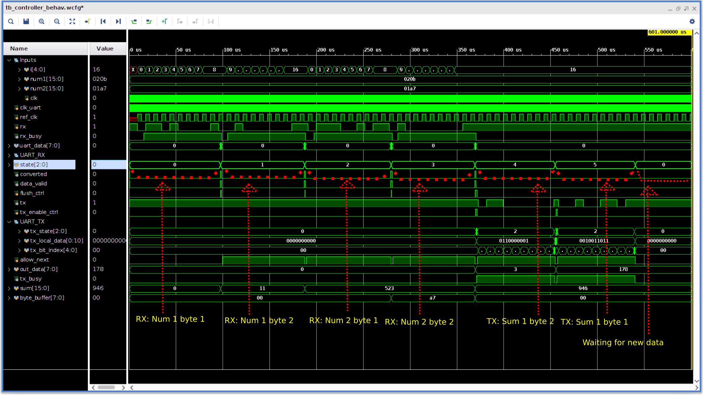

# UART RX and TX cores
### Implementations targeted for the Basys 3 dev board

------------------

## General

This project aims to implement a UART RX and TX module to appreciate the working of this age-old protocol. I have referred to Analog Devices's [Analog Dialogue by Eric Peňa and Mary Grace Legaspi](https://www.analog.com/en/analog-dialogue/articles/uart-a-hardware-communication-protocol.html) to understand most of the details of this protocol.

Iniitally, I intended to utilize to transfer data from the PC to the FPGA, but UART is waay too slow for this(duh). I will try to implement SPI and then eventually USB 2.0 for this purpose.(wish me luck, the USB 2.0 specification is a scary 650 pages).

**Sidenotes:**
1. This was originally a course assignment, where we were provided with someone else's code. I choose to make things hard(and therefore fun) for myself and implement everything from scratch, in my own way.
2. \[update\] My stupid self realized that USB works on 5V. My FPGA's IO is limited to 3.3V(cross-check this). So I either use a fast enough level shifter, or ditch the project for now. I'm afraid it will have to be the latter.
3. I actually managed to get VGA working. I am trying to see if I can somehow tranfer enough data at a baud rate of 921600. My current plan is to transfer a scaled down image and then run upscaling algorithms on the FPGA. Killing two birds with one stone.

--------------------

### Tools required to get this project working

- An FPGA(anything will do, but you will have to make changes). A Xilinx FPGA is preferred, because the simulations are configured for viewing in Xilinx Vivado.

- Vivado 2019.1 or higher

- Python 3.6 or higher. The [pyserial](https://github.com/pyserial/pyserial) library(can be installed using ```pip```). *Alternatively*, you can use your favourite terminal emulator.

--------------------

## Steps for running the project

1. Clone this repository
2. Open the project in Vivado. If you face any toolchain versioning problems, the source files and constraints are available in the ```srcs``` folder. You can manually add in the source files, and the constraints files.
3. Once you add the ```seven_seg_drive.v``` file, please make sure to set its language to ```SystemVerilog```. Verilog-1995 doesn't support 2D memory blocks, which I am using for a lookup table.
4. Generate the bitstream and program your FPGA! It should work fine. If not, raise an issue!

------------------------

## Known bugs

1. The timing is very fiddly. If you change the baud rate, everything breaks down. I am working on fixing this. I've got it working at a baud rate of 912600. Will try to generalize the timing, or atleast put a guide on how to tweak things.
2. The seven segment display doesn't show four digit numbers properly. I swear that the module works by itself. There is something wrong in the controller, where I instantiate the module. I will swap this out for a "scrolling" seven segment display later. I've already got it working, just need to tweak the interface to make it easy to use in other projects.

--------------------

## Simulation

This project was done in steps, so reproducing the simulations is a little troublesome. I am listing the steps needed here. To set a ```Simulation Source``` active, simply right click on it, and then find the ```Set Active``` option. You will manually have to run the simulation for longer. The waveform files are already configured and saved to show whatever is necessary for analysis/debugging.

| Simulation of | Step | Run simulation for |
| -----------| --------- | ------ |
| UART RX    | Set ```sim_1``` active in ```Simulation Sources``` in Vivado |  200us |
| UART TX    | Set ```tx_sim``` active in ```Simulation Sources``` in Vivado | 200us |
| Controller | Set ```controller_sim``` active in ```Simulation Sources``` in Vivado | 600us |
| Seven segment display | Not tested, it works, I know it for weeks now | NA |

------------

## Running the demo
1. Compile and program the bitstream onto an FPGA
2. Run the Python script(```uart_rx_tx.py```), then type in the numbers.
3. Once the sum is shown, you can actually keep sending in pairs of numbers. My controller resets itself after a sum is shown.

-----------

## Folder structure

```bash
$ tree srcs/ images/
srcs/
├── controller.v        # High level UART RX, TX, 7-seg control module
├── seven_seg_drive.v   # Controller for the seven segment display
├── tb_controller.v     # Test bench for timing of main controller
├── tb_uart_rx.v        # RX module's individual testbench
├── tb_uart_tx.v        # TX module's individual testbench
├── uart_rx_constraints.xdc # Pin mappings for everything, clock
├── uart_rx.v           # RX module
└── uart_tx.v           # TX module
images/
├── final_sum_fpga.jpeg         # Final sum shown in 7-seg displays
├── final_sum_terminal.jpeg     # Final sum, seen in the terminal, after TX
├── first_number_fpga.jpeg      # First number(16 bytes) received(7-seg)
├── first_number_terminal.jpeg  # First number sent from PC
└── simulation_timing.png       # Simulation timings for controller

$ ls *.py
uart_rx_tx.py           # The Python script for RX, TX from a PC
```

---------------

## Screenshots


*(above) Simulation waveforms of the controller module*

This image requires heavy explanation to make any sense, so here goes:

### Clocks:
1. ```clk```: The main 100MHz clock of the FPGA.
2. ```uart_clk```: The actual clock used for RX, TX and controller
3. ```ref_clk```: A reference clock, which shows the ideal UART clock(without oversampling). This is generated in the testbench to make sure that the phase drift does not cause timing problems.

### Test bench variables
1. ```i```: Index variable for sending each bit
2. ```num1```: First 16-bit number to send
3. ```num2```: Second 16-bit number to send

### Data
1. ```rx```: The input RX line
2. ```tx```: The output TX line
3. ```uart_data```: Internal bus, showing the data received by the RX module in its ```CONVERSION``` state,
4. ```sum[15:0]```: Stores the sum for output
5. ```byte_buffer[7:0]```: Stores low byte of second number until high byte arrives; in the controller module.

### Signal/flag variables
1. ```state```: **The most important variable**, keeping track of the bytes of data received in the *controller*
2. ```converted```: RX module's indication that data is ready to be read
3. ```data_valid```: RX module's parity check, useless here as parity is disabled.
4. ```flush_ctrl```: Control signal to RX module, telling it to wipe its RX buffer register, and go into ```IDLE``` state, waiting for the next transaction.
5. ```tx_enable_ctrl```: Control signal to TX module, asking it to sample data and start TX eventually.
6. ```allow_next```: Internal control signal to the controller, preventing wrong state changes. Wrong state changes can happen due to the oversampling clock, which is drifing wrt the ideal baud rate clock.
7. ```tx_busy```: TX module's indication that TX is going on, TX line is busy

------------------


*(above) First number sent to the FPGA*


*(above) First number successfully received by the FPGA*


*(above) Second number sent to the FPGA; correct sum received by PC*


*(above) Second number successfully received by the FPGA; correct sum displayed*

-----------------

## Working

I have written the TX and RX UART module independently.

My original intention was to make the baud rate configurable. But due to weird baud rate division ratios, I left it for now.

For RX, I am sampling each bit a certain number of times(15) and then deciding what bit was sent, by sampling the middle three locations and checking the majority. This makes the RX immune to noise and the clock drifting over time.

The TX is pretty much the test bench that I used for RX. Each bit is sent a certain number of clock cycles. This is to compensate for the faster clock, being used for the RX module.

The controller is just keeps track of all the bits received and when it is time to send the sum over TX. It instantiates and synchronizes all the modules.

The seven segment display module is just added to make debugging easier for me. I was initially send the data in the wrong order over the TX line(didn't reverse the bits). This led to the Python script receiving seemingly 'wrong' values. However, the 7-segs showed the correct sum, so I could narrow down the fault to the TX modules's ```CAPTURE``` state, after fiddling with the Python script and figuring out the ordering problem.

All the modules are driven by logical FSMs. For extensive documentation, see each module, which are copied into the ```srcs``` folder for ease.

----------------------
